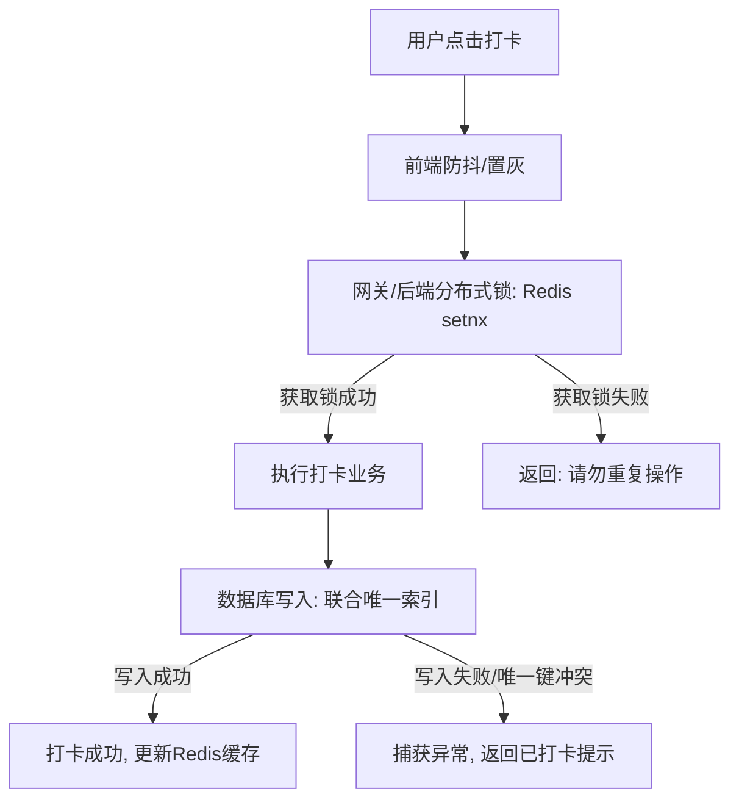

# 15年世界500强企业资深架构师：后端面试题标准解答指引

> **主编寄语：** 
> 作为一名在世界500强科技企业沉淀了15年的架构师，我见证了技术栈的更迭（从最初的EJB、Spring 2.x 到如今的 Spring Boot 3.x、云原生架构），也面试过数百位中高级工程师。
> 优秀的后端开发/架构师，回答问题绝不能只停留在“怎么做”的工具层面，而是要能够洞察背后的**技术本质**、**业务场景**、**设计权衡（Trade-offs）**、**高可用与防御性设计**，以及**标准化流程（SOP）**。
>
> 以下是针对这份面试文档中10道核心问题的深度解答与防坑指南，旨在帮助你展现出大厂架构师的技术视野与落地能力。

---

## 目录
1. [Spring Boot 3.x & JDK 17 升级关注点](#1-spring-boot-3x--jdk-17-升级关注点)
2. [每日单次打卡业务的幂等性设计](#2-每日单次打卡业务的幂等性设计)
3. [线上 Bug 标准排查流程](#3-线上-bug-标准排查流程)
4. [APP 响应卡顿的全链路排查与诊断](#4-app-响应卡顿的全链路排查与诊断)
5. [复杂聚合列表的高性能设计与优化](#5-复杂聚合列表的高性能设计与优化)
6. [云原生基础设施与微信生态集成](#6-云原生基础设施与微信生态集成)
7. [敏捷开发中的需求冲突与向上沟通](#7-敏捷开发中的需求冲突与向上沟通)
8. [非工作时间突发 Bug 的应急响应（SOP）](#8-非工作时间突发-bug-的应急响应sop)
9. [从0到1的系统架构设计与落地方法论](#9-从0到1的系统架构设计与落地方法论)
10. [AI 辅助工程化（AIGC）实践与质量治理](#10-ai-辅助工程化aigc实践与质量治理)

---

### 1. Spring Boot 3.x & JDK 17 升级关注点

#### 考察意图
评估候选人对主流技术栈演进的敏感度、升级风险控制能力以及对底层特性的掌握。

#### 架构师视角的深度解析
从 JDK 8 直跨 JDK 17，以及 Spring Boot 2.x 升级到 3.x，绝非改个 `pom.xml` 版本号那么简单。这是一次涉及**垃圾回收器重构、反射强封装限制、底层依赖包重命名、安全框架重写**的系统性升级，核心在于“平稳过渡”与“性能红利”。

#### 核心回答模板
我们可以从**语法特性、底座变动、生态兼容、GC与性能**四个维度来进行体系化考量：

1. **底座变动（最致命的雷区）：**
   * **Jakarta EE 命名空间迁移：** Spring Boot 3.0 彻底抛弃了 Java EE，全面拥抱 Jakarta EE。这意味着所有以 `javax.*` 开头的包名（如 `javax.servlet.*`、`javax.persistence.*`、`javax.validation.*`）必须修改为 `jakarta.*`。这会直接导致第三方库（如旧版的 Swagger/Springdoc、Hibernate、Quartz、Servlet 依赖）编译报错，必须同步升级这些三方依赖版本。
   * **Spring Security 6.0 的破坏性改动：** 配置类不再继承 `WebSecurityConfigurerAdapter`，而是采用基于 Lambda 的新型 DSL 配置方式，过滤链的构建逻辑发生变化，需要重写安全配置。
2. **生态与第三方库兼容性（JDK 17 的强封装特性）：**
   * JDK 16+ 开始默认启用**强封装（Strong Encapsulation）**，阻止了通过反射访问 JDK 内部类。这会导致依赖 CGLIB、Lombok 或一些老旧序列化库的框架报错。我们需要升级 Lombok（推荐 1.18.22+）、MapStruct 等工具，或在 JVM 启动参数中显式添加 `--add-opens` 以允许非法反射访问。
   * 配置属性重命名：部分 Spring Boot 配置项在 3.x 中被精简或重命名（例如 Redis 相关的配置从 `spring.redis.*` 迁移到了 `spring.data.redis.*`），需要使用 `spring-boot-properties-migrator` 工具在开发环境进行扫描并修正。
3. **性能红利与 GC 调优：**
   * **G1 垃圾收集器的巨大提升：** JDK 17 中的 G1 性能相较于 JDK 8 提升了 20%~30%，内存占用更少，Full GC 频率大幅降低。
   * **ZGC（不可忽视的低延迟神器）：** 在大内存（>16GB）、超低延迟（<10ms）的场景下，可以考虑引入 ZGC 替代 G1。
4. **编译与部署演进：**
   * Spring Boot 3.x 深度集成 GraalVM，支持 **AOT（Ahead-of-Time）编译** 生成 Native Image。对于 Serverless 或微服务快速冷启动场景，可关注此项技术的落地。

#### 避坑指南
* **避免说：** “直接修改 pom.xml 版本，编译通不过就一个个改报错。”（缺乏风险意识和方法论）。
* **架构师建议：** 升级应遵循“两步走”战略——先在 Spring Boot 2.7 环境下将 JDK 升级至 17 并稳定运行（解决 JDK 兼容性），然后再将 Spring Boot 2.7 升级至 3.x（解决 Jakarta EE 及 Spring 生态兼容性）。

---

### 2. 每日单次打卡业务的幂等性设计

#### 考察意图
考察高并发分布式环境下的幂等性设计、分布式锁机制以及数据库高可靠一致性设计。

#### 架构师视角的深度解析
“用户每天只能打卡一次”是一个典型的**业务幂等**场景，而非纯技术幂等（如网络重试导致的重复请求）。高并发下，用户快速双击、弱网重试、甚至恶意刷接口，都可能导致数据混乱。解决此类问题必须采用**全链路多重防御体系**，即“前端拦截 + 接入层防重 + 业务逻辑分布式锁 + 数据库兜底”。

#### 核心回答模板
为保证该业务的绝对幂等，我通常会设计**三重防御链**：



1. **第一重：接入层限制与分布式锁（防止短时间内并发双击）**
   * 当请求到达后端时，利用 Redis 的 `SETNX`（或 Redisson）构建分布式锁。
   * **Key 设计：** `lock:checkin:user:{userId}:{yyyyMMdd}`，锁过期时间设为 5 秒。
   * **逻辑：** 抢到锁的请求进入业务流程；未抢到锁的请求，直接返回“请求正在处理中，请勿重复点击”。这可以阻断 99% 的并发重复请求，减轻数据库压力。
2. **第二重：业务状态快速检索（Cache-Aside Pattern）**
   * 在进入核心业务前，快速查询 Redis 中当天的打卡状态（例如使用 Bitmap，或简单的 String Key `cache:checkin:status:{userId}:{yyyyMMdd}`）。
   * 如果缓存显示已打卡，则直接返回成功。这样可以避免穿透到数据库。
3. **第三重：数据库联合唯一索引（终极兜底，防线闭环）**
   * **表结构设计：** 
     ```sql
     CREATE TABLE `user_checkin_log` (
       `id` bigint(20) NOT NULL AUTO_INCREMENT,
       `user_id` bigint(20) NOT NULL,
       `checkin_date` date NOT NULL, -- 仅存储日期, 如 '2026-07-10'
       PRIMARY KEY (`id`),
       UNIQUE KEY `uk_user_date` (`user_id`, `checkin_date`) -- 核心唯一索引
     ) ENGINE=InnoDB;
     ```
   * 即使 Redis 挂掉、分布式锁失效，由于 `uk_user_date` 唯一索引的存在，数据库层面绝对无法插入第二条同用户同日期的记录。并发写时，后到的请求会抛出 `DuplicateKeyException`，后端捕获该异常，友好提示用户即可。

#### 避坑指南
* **淘汰回答：** “只在前端做置灰限制”或“只在 Spring 代码里写 `if(query() == null) { insert(); }`”（高并发下存在 Read-View 时差，必定产生脏数据）。
* **架构师建议：** 必须强调**数据库唯一索引**是保底的最后防线，且 `checkin_date` 应当采用 `DATE` 类型而非 `DATETIME`，这样才能完美利用联合索引的唯一性。

---

### 3. 线上 Bug 标准排查流程

#### 考察意图
评估候选人在紧急状态下的逻辑思维能力、排查方法论以及对常用诊断工具（如 Arthas）的实际应用经验。

#### 架构师视角的深度解析
面对线上 Bug，慌乱和瞎猜是新手特征。成熟的架构师需要遵循一套科学的**问题闭环 SOP**（收集 -> 复现 -> 定位 -> 止血 -> 根治 -> 复盘），并且具备在不重启服务的前提下在线诊断的能力。

#### 核心回答模板
我的线上 Bug 排查流程遵循以下标准化步骤：

1. **第一步：信息收集与临时止血（Containment & Mitigation）**
   * **收集要素：** 受影响的用户 ID、接口路径、发生时间段、具体的客户端平台及版本、报错截图。
   * **评估影响面：** 如果是全站不可用或核心支付链路中断（P0 级灾难），**第一要务是止血**（回滚代码、切备用通道、降级置灰功能或开启限流），而非慢吞吞排查。
2. **第二步：全链路追踪与日志检索（Traceability）**
   * 通过链路追踪系统（APM，如 SkyWalking/Jaeger）提取异常请求的 `traceId`。
   * 在日志中心（ELK / SLG）根据 `traceId` 检索完整的上下文日志、堆栈信息、以及微服务间的调用耗时。
   * 检查数据库慢查询日志或连接池状况，确定是否因为 DB 瓶颈引发超时报错。
3. **第三步：动态在线诊断（利用 Arthas 等利器）**
   * 如果问题在测试环境无法复现，且属于偶发性异常，我会直接登录预发/生产节点，使用 **Arthas** 进行诊断：
     * `watch <类名> <方法名> "{params, returnObj, throwExp}" -n 5 -x 3`：实时监控该方法的输入参数、返回值及抛出的异常。
     * `trace <类名> <方法名>`：分析该方法内部每一步的耗时，找出是否由于第三方 API 响应慢或本地死锁导致的卡顿。
     * `monitor`：定时采样方法的调用次数、成功率及平均响应时间。
     * `jad` / `mc` / `retransform`：在极端紧急且无法立即发版的情况下，对类进行反编译、修改并热替换（谨慎使用）。
4. **第四步：修复与回归验证**
   * 编写对应的 Unit Test 覆盖此 bug 场景，防止复发。在 Stage（预发）环境进行功能和回归测试，确认无误后灰度发布上线。
5. **第五步：事后复盘（Post-Mortem）**
   * 产出事故报告，分析 Root Cause（根本原因），提出改进建议（如增加监控报警、补充灰度策略、重构脆弱代码）。

#### 避坑指南
* **避免说：** “本地改改代码试试”、“重启一下服务器”。这在大厂是严重的无序操作风险。
* **架构师建议：** 必须主动提及 **`traceId` 全链路追踪** 和 **Arthas**（或者 JVM 原生的 `jstack`/`jmap`），这代表你具备大型分布式系统的实战诊断经验。

---

### 4. APP 响应卡顿的全链路排查与诊断

#### 考察意图
考察对计算机网络、系统性能、操作系统（CPU、内存、I/O）、JVM 调优以及数据库等全链路性能瓶颈的把控力。

#### 架构师视角的深度解析
APP 卡顿是一个典型的“表象在前端，根源在全链路”的问题。排查此问题需要从**客户端、网络传输、网关、应用服务器、中间件及数据库**六个层级层层剥离，以数据和指标说话。

#### 核心回答模板
面对 APP 卡顿反馈，我会采用“自顶向下，由表及里”的排查模型：

```
[客户端 APP] ──(网络/CDN)──> [负载均衡/网关] ──> [后端微服务] ──> [Redis/DB]
     │                             │                 │                │
(卡顿/渲染慢)                   (带宽限制/QPS)      (CPU/GC/线程池)    (慢查询/锁)
```

1. **第一阶段：定位卡顿源头（全链路监控分析）**
   * 调取 APM 系统中的 P99 响应时间。
   * 如果后端 API 响应极快（如 <50ms），但客户端卡顿：排查客户端首屏渲染阻塞、大图未压缩、局部多次重绘、大 JSON 反序列化耗时、或 CDN 静态资源加载慢。
   * 如果后端 API 响应确实慢（如 >1s）：进入后端与服务侧排查。
2. **第二阶段：后端应用服务器（JVM/操作系统）排查**
   * **宿主机指标检查：** 登录服务器查看 CPU 负载（`top -c`、`vmstat`）、内存使用率（`free -m`）、磁盘 I/O（`iostat -x 1`）、带宽是否跑满。
   * **JVM 垃圾回收（GC）诊断：** 检查是否频繁发生 **Full GC** 导致 STW（Stop-The-World）。
     * 使用 `jstat -gcutil <pid> 1000` 观察 Eden/Old 区增长及 GC 耗时。
     * 如果 Full GC 频繁，使用 `jmap -dump:format=b,file=heap.hprof <pid>` 导出堆内存，通过 MAT 或 JProfiler 分析是否内存泄漏（如 LocalCache 未设置过期、大对象未释放）。
   * **线程状态与连接池分析：**
     * 使用 `jstack <pid>` 查看线程堆栈，检查是否有大量线程处于 `BLOCKED` 或 `WAITING` 状态。
     * 检查 HikariCP 连接池指标：活跃连接数是否占满，等待获取连接的时间是否过长。
     * 检查 Tomcat/Web 容器最大线程数是否达到上限。
3. **第三阶段：数据库与缓存排查**
   * **慢 SQL 定位：** 查看 MySQL 慢查询日志（`slow_query_log`）。使用 `EXPLAIN` 分析执行计划，看是否缺失索引、存在全表扫描，或者发生了 File Sort。
   * **锁争用：** 检查是否有行锁被长时间持有、或者表锁冲突。
   * **Redis 瓶颈：** 检查 Redis 是否有 BigKey、HotKey 导致单线程卡顿，或者 Redis 内存不足触发了驱逐策略（Eviction）。

#### 避坑指南
* **淘汰回答：** “直接重启服务器”、“加机器”。这是治标不治本、甚至可能导致更严重雪崩的做法。
* **架构师建议：** 给出明确的排查路径。强调通过分析 CPU、内存、GC、线程池、SQL 执行计划这五个核心维度来精确定位问题。

---

### 5. 复杂聚合列表的高性能设计与优化

#### 考察意图
考察大数据量下的读性能优化、CQRS（读写分离架构）、缓存架构设计、多线程并发协同以及数据冗余设计。

#### 架构师视角的深度解析
在社交、电商类业务中，列表页不仅包含主体数据，还大量掺杂关联维度（如用户信息、点赞状态、黑名单等）。
* **Junior 做法：** 直接多表 `JOIN`（随着数据量破百万，数据库直接崩溃），或者循环调用微服务接口（产生著名的 `N+1` 查询问题，RPC 网络开销极大）。
* **Senior 做法：** 采用**“读写分离、轻重分离、异步聚合、空间换时间”**的架构思维。

#### 核心回答模板
针对这种高并发、大数据量的复杂聚合列表，我的标准架构设计方案如下：

1. **核心原则一：主数据分页，关联数据异步/批量聚合**
   * **不要直接在 SQL 中 JOIN！** 
   * **第一步：** 从主库或只读副本（/ES）中仅查询主数据列表，例如通过分页获取 20 条帖子 ID。
   * **第二步：** 收集这 20 条帖子的 `author_id` 和 `post_id`。
   * **第三步：** 在 Java 业务层，使用 **线程池（CompletableFuture）** 并发调用相关子服务（或批量查询缓存/数据库）：
     * 任务 A：批量获取 20 个用户的信息：`SELECT ... WHERE id IN (...)`。
     * 任务 B：批量获取点赞、评论数：从 Redis 中通过 `MGET` 或 Pipeline 批量获取。
     * 任务 C：黑名单/不喜欢过滤。
   * **第四步：** 在内存中将结果聚合装配进 DTO 吐给前端。
2. **核心原则二：读写分离与 CQRS（命令查询职责分离）**
   * 列表数据通常可以容忍微小延迟（弱一致性）。
   * 将主数据写入与列表查询分离。列表数据可以使用 **Elasticsearch (ES)** 作为检索引擎。当数据变更时，通过 MQ 异步将数据同步到 ES 中，列表页的过滤和分页直接查询 ES。
3. **核心原则三：数据冗余与多级缓存**
   * **计数数据冗余：** 点赞数、评论数、收藏数不要每次去 count。在主表或缓存中冗余这些计数值，写操作时利用 Redis `INCR/DECR` 原子累加，定期异步同步回数据库。
   * **热点实体缓存：** 用户基础信息等不常变的数据，直接缓存在 Redis Hash 中，命中率达 99% 以上。
4. **核心原则四：用户个性化关联（黑名单、已赞状态）的快速判定**
   * **黑名单判定：** 用户黑名单通常不长，可以在用户登录时将其黑名单列表（User ID 集合）加载到 Redis Set 中，在聚合时直接内存过滤；或者使用布隆过滤器（Bloom Filter）在网关层做过滤。
   * **已赞/已收藏状态：** 使用 Redis 的 SISMEMBER 快速判断当前用户是否在某帖子的“点赞用户集合”中。

#### 避坑指南
* **淘汰回答：** “写一个复杂的 SQL，把 user 表、like 表、comment 表、blacklist 表全部 JOIN 起来。”（大数量下无异于自杀）。
* **架构师建议：** 提出**“批量查（In-Clause）+ 内存聚合（Memory Assembler） + Redis 缓存计数 + ES 检索”**的黄金组合拳方案。

---

### 6. 阿里云体系了解程度、服务器了解程度、微信体系了解程度

#### 考察意图
评估候选人的工程落地能力、全栈基础设施熟悉度，确认其能即插即用，不需要额外的平台学习成本。

#### 架构师视角的深度解析
架构师必须知行合一。对基础云服务、服务器底座以及三方生态（如微信）的广度与深度，决定了其架构方案的物理边界和落地速度。

#### 核心回答模板
我在实际项目和架构设计中，深度使用并熟悉以下技术体系：

1. **阿里云（Aliyun）云原生体系：**
   * **计算与容器化：** 熟练使用 **ACK (容器服务 Kubernetes 版)** 进行微服务治理，配合 **ECS** 作为高算力节点。使用过 **FC (函数计算)** 实现 Serverless 任务。
   * **数据库与存储：** 熟练掌握 **RDS (MySQL/PostgreSQL)** 的读写分离与分库分表配置，以及分布式数据库 **PolarDB**。使用 **OSS** 存储海量静态资源，并配置 **CDN** 加速。
   * **中间件与安全：** 深度应用云上 **RocketMQ / RabbitMQ**；利用 **ALB / NLB (应用/网络负载均衡)** 做流量分发；配置 **WAF (Web 应用防火墙)** 和安全组策略，确保内网网络安全。
2. **Linux 服务器运维与调优：**
   * **日常监控与诊断：** 熟练使用 `top/htop`（CPU）、`free -m`（内存）、`df -h/du`（磁盘）、`iostat/sar`（I/O）、`netstat/ss`（网络连接）定位主机瓶颈。
   * **系统参数优化：** 熟悉 `/etc/security/limits.conf`（修改最大文件打开数限制句柄数 `ulimit`），以及调整 `/etc/sysctl.conf` 下的 TCP 连接回收参数（如 `keepalive`、`tw_reuse`），以承载高并发连接。
3. **微信生态链深度对接：**
   * **小程序与公众号：** 熟练实现微信 OAuth 2.0 授权登录流程（`code` 换取 `openid/unionid`）。处理过微信解密算法（获取用户绑定的手机号、运动数据等）。
   * **微信支付体系：** 独立负责过 **V3 版本微信支付** 架构设计（JSAPI、H5、App、Native 扫码支付）。设计过高可靠的支付回调（Callback）防重、对账、退款及签名安全验证机制。

#### 避坑指南
* **避免说：** “听过，但有运维做，我平时不碰服务器和阿里云控制台。”（这会让面试官觉得你缺乏全栈落地和排障能力）。
* **架构师建议：** 列举具体使用过的产品组件，并重点提及你在这些技术体系中做过的**高并发、高安全或高可用实践**。

---

### 7. 开发过程中，领导有新的需求进来，要求尽快处理，怎么解决？

#### 考察意图
考察项目管理、敏捷迭代下的需求变更管理、冲突协调能力，以及向上管理与沟通技巧。

#### 架构师视角的深度解析
在互联网敏捷开发中，插队需求是常态。
* **低情商表现：** 直接说不（显得固执、不配合业务）；或者满口答应，然后带团队加班，最后延期或写出 Bug 频出的代码。
* **高情商/架构师表现：** 引入**“能量守恒定律”**。通过客观的数据、排期影响与可选方案，将选择权交回给决策者。

#### 核心回答模板
面对突发的紧急插队需求，我会在**不直接拒绝**的前提下，遵循**评估、呈现、置换、妥协**的步骤进行向上沟通：

1. **第一步：明确需求价值与紧急度（Active Listening）**
   * 与领导和产品经理对齐：该需求的商业背景、期望上线时间、如果不做会有什么后果。有些“尽快”可能只是产品经理的口头禅，要明确真正的 Deadline。
2. **第二步：量化评估影响（Impact Analysis）**
   * 迅速组织核心研发人员进行技术评估，确定新需求所需的人工时（Man-Hours）以及对当前 Sprint（迭代）的影响。
   * 盘点当前 Sprint 正在进行的任务，整理出明确的受影响列表。
3. **第三步：提供“可供选择的方案”（Give Options, Not Answers）**
   * 拿着评估结果找到领导，不带情绪地呈现以下选择方案：
     * **方案 A（置换）：** 承接新需求，但必须将当前 Sprint 中优先级较低的任务（如任务 X、任务 Y）移出本期迭代，顺延至下一期。
     * **方案 B（MVP 降级）：** 如果当前任务和新任务都必须按时上，那么评估新需求是否可以做一个“极简版（MVP）”，先解决痛点，后续迭代再完善。
     * **方案 C（资源扩容）：** 调配其他兄弟团队的空闲人力，或接受当前版本整体延期 1~2 天交付。
4. **第四步：协助决策，达成共识**
   * 让领导根据业务大局做出抉择。一旦达成共识，立即更新项目管理看板，并向团队明确变更后的新目标，避免团队产生抱怨。

#### 避坑指南
* **淘汰回答：** “死磕到底，坚决不改需求。”或“无条件加班硬抗。”（前者情商低，后者极易导致系统线上崩溃）。
* **架构师建议：** 强调**“用数据说话，让决策者做选择题而非是非题”**。

---

### 8. 非工作时间，公司群有提出Bug，怎么应急处理（非频繁）

#### 考察意图
考察责任心、危机意识、应急响应机制（Incident Response SOP）以及团队管理能力。

#### 架构师视角的深度解析
生产环境 Bug 是悬在后端架构师头上的达摩克利斯之剑。对于非工作时间的 Bug，既不能视而不见，也不能无视严重度把全员大半夜叫起来加班。核心是**快速分级、精准止血、闭环改进**。

#### 核心回答模板
我会按照以下应急响应 SOP 进行高效处理：

1. **五分钟内快速响应（Acknowledge）：**
   * 看到消息后，第一时间在群里回复：“收到，正在排查。” 这一步至关重要，能让领导和业务部门知道问题有人在跟进，避免焦虑蔓延。
2. **三分钟快速分级与评估（Triage）：**
   * **P0/P1 级（核心功能受阻/大面积故障）：** 如支付失败、全站白屏、用户无法登录。
     * **处理路径：** 立即拉起紧急线上会议（腾讯会议/钉钉），呼叫核心研发、DBA 及运维人员上线共同排查。
   * **P2/P3 级（非核心功能受损/局部受影响）：** 如后台报表展示错乱、非核心入口展示异常、偶发性边缘 bug。
     * **处理路径：** 确认影响面可控后，群内回复：“已确认问题，属于非核心功能异常，受影响范围仅占 X%，不影响主业务。为保证线上环境稳定，我们将在下周一工作时间修复并上线。”
3. **P0/P1 核心阻断（Mitigation）：**
   * **首要目标是恢复服务（止血），而非完美修复。** 
   * 优先考虑：配置降级开关、关闭受影响功能、在网关层限流、或者回滚上一次发布的代码。
4. **定位与彻底修复（Remediation）：**
   * 服务恢复后，安排专人梳理代码，彻底排查并修复 Bug。
5. **事后复盘（Post-Mortem）：**
   * 下一个工作日，组织团队复盘。讨论：为什么测试阶段没测出来？是否有监控死角？如何优化监控告警？

#### 避坑指南
* **淘汰回答：** “不回消息，等周一上班再说。”（责任心缺失）；“直接开始改代码，改完直接上生产。”（违背生产发布规范，极易引发二次事故）。
* **架构师建议：** 突出**“首要任务是止血/恢复服务，而非当场Debug”**，以及规范的**分级响应机制**。

---

### 9. 如果给你一个方向或演示包，如何落地成可用项目，如何设计整个系统？有哪些考量因素？

#### 考察意图
考察从0到1的系统架构设计能力、宏观规划能力、技术选型原则以及对业务边界的敏感度。

#### 架构师视角的深度解析
这是架构师面试的核心题。
* **淘汰回答：** “直接跑 Demo，看懂代码，然后照猫画虎搭个项目。”（只具备搬砖思维）。
* **架构师思维：** 应该是一个包含“业务梳理 -> 架构选型 -> 非功能性设计 -> 演进规划 -> 交付保障”的闭环方法论。

#### 核心回答模板
把一个演示包/概念方向落地成生产可用的工业级项目，我会遵循以下五个阶段展开设计：

```
[概念/Demo] ──> [1. 需求与容量评估] ──> [2. 技术选型与分层] ──> [3. 稳定性与高可用设计] ──> [4. 观测与交付]
```

1. **第一阶段：需求梳理与容量规划（Requirements & Sizing）**
   * **明确边界：** 搞清楚核心业务流、用户旅程、痛点。
   * **容量规划：** 预估初期及中后期的**用户量（DAU/MAU）、日交易量、并发指标（QPS/TPS 峰值）、数据存储量（年增长率）**。由此决定数据库分库分表策略、带宽需求和服务器规格。
2. **第二阶段：架构风格与技术选型（Architecture & Tech Stack）**
   * **化繁为简：** 除非业务极其庞大且团队资源充足，否则**初期坚决采用模块化单体架构（Modular Monolith）**，快速推向市场；设计上采用 DDD（领域驱动设计）划分限界上下文，方便后续平滑拆分为微服务。
   * **选型原则：** 核心栈选用团队熟悉度最高、社区生态最成熟的组合，如：Java 17 + Spring Boot 3 + Spring Cloud Alibaba + MySQL + Redis + RabbitMQ。不盲目追求新技术，以稳定高效为首要目标。
3. **第三阶段：高可用与稳定性设计（Resilience & High Availability）**
   * **单点消除：** 应用层无状态设计，通过网关 + ALB 实现多实例负载均衡；数据库配置主从架构/多可用区部署。
   * **自我保护机制：** 网关层引入 Sentinel 做流量控制；核心链路配置熔断、降级与超时机制，防止级联雪崩。
   * **数据一致性：** 跨服务交互使用可靠消息最终一致性方案（本地消息表/RocketMQ 事务消息）。
4. **第四阶段：安全性与合规性（Security）**
   * **防线设计：** 网关层统一做 JWT 验签与防重放攻击；数据传输全程 HTTPS；对数据库中的敏感信息（密码、手机号、身份证）实施加密存储。
5. **第五阶段：可观测性与 CI/CD（Observability & Delivery）**
   * 规范多套环境（Dev、Test、Stage、Prod），搭建基于 GitLab CI/CD + Docker + ACK 的自动化流水线。
   * 接入 Prometheus + Grafana 指标监控，接入 ELK 进行集中式日志管理，确保项目上线后状态透明可控。

#### 避坑指南
* **避免说：** “用最高深、最新的技术，把能加的中间件全部加上。”（这会带来极高的研发与运维成本，是架构设计大忌）。
* **架构师建议：** 强调**“演进式架构”**理念——“好的架构是生长出来的，不是设计出来的。”在满足当前业务的基础上，保留支持未来 10 倍增长的弹性和扩展性。

---

### 10. 现在使用什么AI、哪些AI工具。平常获取AI资讯的渠道。AI代码在开发中的占比，用什么方式提升效率。AI写的代码如何保证质量？怎么处理AI代码产生的幻觉？

#### 考察意图
考察候选人的前沿工具学习能力、工程效率意识，以及对于 AI 辅助编程所带来的代码质量隐患的防范意识。

#### 架构师视角的深度解析
AI 已经成为研发效能倍增器，但大模型自带的“幻觉”是工程交付的隐形杀手。架构师需要建立**“AI 提供灵感与初稿，人类提供审查与约束”**的双安全锁机制，利用静态分析和自动化测试对 AI 代码进行质量治理。

#### 核心回答模板

1. **我所使用的 AI 工具链与获取资讯渠道：**
   * **工具栈：** 
     * **Cursor / GitHub Copilot：** 作为日常开发 IDE 插件，用于代码自动补全、上下文问答和重构建议。
     * **Gemini 1.5 Pro / Claude 3.5 Sonnet：** 用于复杂的架构设计方案推演、技术选型对比、编写复杂的 SQL 或正则规则，以及排查诡异的线上堆栈报错。
     * **Local DeepSeek-Coder (Ollama)：** 用于公司内部敏感代码、保密协议相关的离线分析。
   * **资讯渠道：** 关注 Hacker News、Reddit 的 `r/MachineLearning` 板块、GitHub Trending、以及知名科技巨头（如 Google DeepMind、OpenAI）的官方技术博客。
2. **AI 在开发中的占比与提效方式：**
   * 目前我的项目开发中，**大约 40% 的代码由 AI 辅助生成**。
   * **主要提效点：** 
     * **脚手架与样板代码生成：** 快速生成 DTO、Entity、MyBatis XML、以及各种格式转换器。
     * **单元测试与压测脚本：** 编写完核心逻辑后，让 AI 生成包含各种边界条件和异常场景的 Mockito 单元测试。
     * **编写接口文档：** 根据 Controller 代码，自动生成 OpenAPI/Swagger 定义。
3. **如何保证 AI 写的代码质量并防范“幻觉”：**
   * **原则：“Trust, but Verify”（信任，但必须验证）**。绝对不盲目 Copy AI 生成的代码。
   * **静态代码规约检查：** 强行在 CI/CD 中卡点 SonarQube、Checkstyle，自动发现 AI 编码可能引入的空指针漏洞、魔术值或未关闭的流。
   * **强类型约束与编译关卡：** Java 语言的强类型系统天然能够拦截 AI 生成的不存在的类成员或方法。
   * **单元测试覆盖率兜底：** AI 生成的代码必须通过人工手写的核心断言测试。编写核心业务单测，确保测试覆盖率（如 Jacoco）达到 80% 以上。
   * **严格的 Code Review：** AI 生成的非凡逻辑，在团队的 Merge Request 中必须作为重点审查对象，双人确认后方可合入主干。

#### 避坑指南
* **淘汰回答：** “我不怎么用 AI” 或 “AI 写的代码没问题，省了我很多时间，直接用就行。”
* **架构师建议：** 展现出既积极拥抱 AI 提效，又对 AI 幻觉保持高度警惕的客观态度，核心切入点应是**“通过工程化规范（SonarQube、单元测试、Code Review）来对冲 AI 的不确定性”**。
